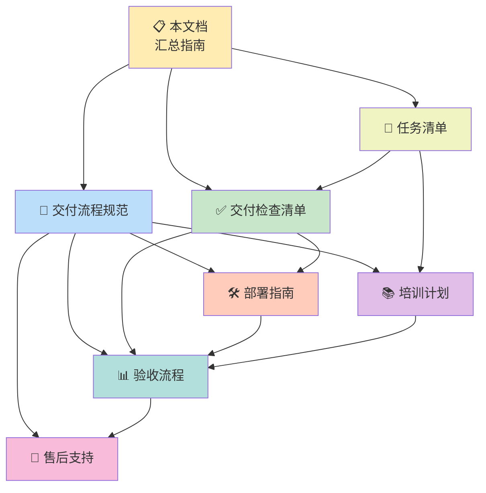

# 客户交付流程汇总指南

> **房屋租售系统交付文档总入口**  
> **版本：** v1.0.0  
> **最后更新：** 2026-02-28  
> **适用系统：** 房屋租售管理系统

---

## 📋 目录

1. [交付流程概览](#1-交付流程概览)
2. [交付文档清单](#2-交付文档清单)
3. [快速开始指南](#3-快速开始指南)
4. [交付成功要素](#4-交付成功要素)
5. [文档导航](#5-文档导航)

---

## 1. 交付流程概览

### 1.1 六阶段交付流程图


### 1.2 各阶段说明

| 阶段 | 名称 | 预计时间 | 主要活动 | 关键产出 |
|------|------|----------|----------|----------|
| **阶段一** | [交付前准备](#阶段一交付前准备) | 1-2 周 | 代码审查、性能测试、安全加固、文档准备 | 交付包、测试报告 |
| **阶段二** | [部署实施](#阶段二部署实施) | 3-5 天 | 环境准备、系统部署、配置调优、数据迁移 | 运行系统、部署报告 |
| **阶段三** | [用户培训](#阶段三用户培训) | 2-3 天 | 管理员培训、用户培训、操作演示 | 培训记录、考核结果 |
| **阶段四** | [文档移交](#阶段四文档移交) | 1-2 天 | 技术文档、用户手册、运维手册移交 | 文档签收单 |
| **阶段五** | [验收确认](#阶段五验收确认) | 1-2 周 | 功能验收、性能验收、文档验收 | 验收报告 |
| **阶段六** | [售后支持](#阶段六售后支持) | 按合同 | 技术支持、系统维护、定期巡检 | 服务报告 |

### 1.3 整体时间线

```
总交付周期：4-6 周（标准项目）

Week 1-2: ████████████████████ 交付前准备
Week 3:   ████████ 部署实施
Week 4:   ████████ 用户培训 + 文档移交
Week 5-6: ████████████████████ 验收确认
          ↓
       售后支持（按合同期限）
```

---

## 2. 交付文档清单

### 2.1 文档分类索引

```
交付文档体系
├── 📘 核心交付文档
│   ├── 交付流程规范 (spec.md)
│   ├── 交付检查清单 (delivery-checklist.md)
│   └── 任务清单 (tasks.md)
│
├── 🛠️ 技术实施文档
│   ├── 部署实施指南 (deployment-guide.md)
│   ├── 配置检查清单 (checklist.md)
│   └── 验收测试用例
│
├── 📚 用户支持文档
│   ├── 用户培训计划 (training-plan.md)
│   ├── 操作手册
│   └── 常见问题 FAQ
│
├── ✅ 验收文档
│   ├── 验收流程规范 (acceptance-process.md)
│   ├── 验收报告模板
│   └── 测试报告
│
└── 🔧 售后支持文档
    ├── 售后支持流程 (support-process.md)
    ├── 运维手册
    └── 服务级别协议 (SLA)
```

### 2.2 完整文档列表

| 序号 | 文档名称 | 文件路径 | 用途说明 | 阅读对象 | 状态 |
|------|----------|----------|----------|----------|------|
| **核心文档** |
| 1 | 交付流程规范 | [spec.md](spec.md) | 定义交付流程标准和要求 | 项目经理、交付团队 | ✅ |
| 2 | 交付检查清单 | [delivery-checklist.md](delivery-checklist.md) | 交付前准备检查项 | 交付工程师、QA | ✅ |
| 3 | 任务清单 | [tasks.md](tasks.md) | 交付任务分解和跟踪 | 项目经理、团队成员 | ✅ |
| **技术文档** |
| 4 | 部署实施指南 | [deployment-guide.md](deployment-guide.md) | 系统部署步骤和配置说明 | 运维工程师、实施顾问 | ✅ |
| 5 | 配置检查清单 | [checklist.md](checklist.md) | 环境配置验证 | 实施工程师 | ✅ |
| 6 | 代码审查清单 | [delivery-checklist.md](delivery-checklist.md#1-代码审查和最终测试清单) | 代码质量检查 | 开发团队、QA | ✅ |
| **用户文档** |
| 7 | 用户培训计划 | [training-plan.md](training-plan.md) | 培训大纲、课程安排 | 培训讲师、学员 | ✅ |
| 8 | 管理员操作手册 | 待补充 | 系统管理员使用指南 | 系统管理员 | ⏳ |
| 9 | 最终用户手册 | 待补充 | 普通用户操作指南 | 最终用户 | ⏳ |
| 10 | 常见问题 FAQ | [support-process.md](support-process.md#54-常见问题解答 faq) | 常见问题解答 | 所有用户 | ✅ |
| **验收文档** |
| 11 | 验收流程规范 | [acceptance-process.md](acceptance-process.md) | 验收标准和流程 | 验收组、客户 | ✅ |
| 12 | 功能验收测试用例 | [acceptance-process.md](acceptance-process.md#2-功能验收测试) | 功能验证测试 | 测试人员、客户 | ✅ |
| 13 | 性能验收测试用例 | [acceptance-process.md](acceptance-process.md#3-性能验收测试) | 性能验证测试 | 测试人员、客户 | ✅ |
| 14 | 文档验收清单 | [acceptance-process.md](acceptance-process.md#4-文档验收) | 文档完整性检查 | 验收组 | ✅ |
| 15 | 验收报告模板 | [acceptance-process.md](acceptance-process.md#1-验收报告模板) | 验收结论记录 | 验收组、客户 | ✅ |
| **售后文档** |
| 16 | 售后支持流程 | [support-process.md](support-process.md) | 售后服务规范 | 支持团队、客户 | ✅ |
| 17 | 服务级别协议 | [support-process.md](support-process.md#3-服务级别协议 sla) | 服务标准承诺 | 客户、支持团队 | ✅ |
| 18 | 运维手册 | 待补充 | 系统运维指南 | 运维工程师 | ⏳ |

**图例：** ✅ 已完成 | ⏳ 待补充 | 🔄 更新中

### 2.3 文档用途速查

| 使用场景 | 推荐文档 | 阅读顺序 |
|----------|----------|----------|
| **首次接触交付** | 本文档 → spec.md → delivery-checklist.md | 1→2→3 |
| **准备交付环境** | deployment-guide.md → checklist.md | 4→5 |
| **组织用户培训** | training-plan.md → 操作手册 | 7→8→9 |
| **进行验收测试** | acceptance-process.md → 测试用例 | 11→12→13 |
| **寻求技术支持** | support-process.md → FAQ | 16→10 |

---

## 3. 快速开始指南

### 3.1 交付准备检查清单

#### 启动交付前必检项

```
□ 项目内部验收已通过
□ 所有功能模块开发完成
□ 代码审查完成且无严重问题
□ 性能测试达标（响应时间、并发数）
□ 安全测试通过（无高危漏洞）
□ 交付文档初稿已完成
□ 客户环境信息已收集
□ 交付团队已组建
□ 交付计划已制定并获客户确认
```

#### 交付包完整性检查

```
□ 源代码（前后端）
□ 数据库脚本（初始化 + 种子数据）
□ 配置文件模板
□ 部署脚本（安装、启动、停止）
□ 用户手册
□ 部署手册
□ API 文档
□ 运维手册
□ 测试报告
□ 验收用例
```

### 3.2 关键联系人信息

| 角色 | 职责 | 联系方式 | 可用时间 |
|------|------|----------|----------|
| **交付负责人** | 整体交付协调 | 📧 delivery@company.com<br>📱 400-XXX-XXXX | 工作日 9:00-18:00 |
| **技术负责人** | 技术问题处理 | 📧 tech@company.com<br>📱 138-XXXX-XXXX | 7×12 小时 |
| **培训讲师** | 用户培训组织 | 📧 training@company.com | 预约制 |
| **售后支持** | 日常问题解答 | 📧 support@company.com<br>📱 400-XXX-XXXX | 工作日 9:00-18:00 |
| **紧急支持** | P1 级问题处理 | 📱 138-XXXX-XXXX | 7×24 小时 |

### 3.3 常用资源链接

| 资源类型 | 名称 | 链接/位置 | 说明 |
|----------|------|-----------|------|
| **文档仓库** | 交付文档目录 | `d:\Pro\Housing_ental_system\.trae\specs\client-delivery\` | 所有交付文档 |
| **工单系统** | 技术支持工单 | https://support.company.com | 提交问题工单 |
| **知识库** | 产品知识库 | https://kb.company.com | 自助查询 |
| **培训平台** | 在线培训系统 | https://learn.company.com | 视频课程 |
| **社区论坛** | 用户交流社区 | https://bbs.company.com | 用户互助 |
| **下载中心** | 软件和文档下载 | https://download.company.com | 安装包、手册 |

---

## 4. 交付成功要素

### 4.1 关键成功因素 (CSF)

```
┌─────────────────────────────────────────────────────────────┐
│                    交付成功五要素                            │
├─────────────────────────────────────────────────────────────┤
│                                                             │
│  1️⃣  充分准备          交付前完成所有检查和测试              │
│       ████████████ 100%                                     │
│                                                             │
│  2️⃣  有效沟通          与客户保持密切沟通，及时同步进展      │
│       ████████████ 100%                                     │
│                                                             │
│  3️⃣  专业团队          经验丰富的交付团队，明确分工          │
│       ████████████ 100%                                     │
│                                                             │
│  4️⃣  质量保证          严格执行质量标准，不放过任何问题      │
│       ████████████ 100%                                     │
│                                                             │
│  5️⃣  持续支持          交付后持续跟进，确保客户成功使用      │
│       ████████████ 100%                                     │
│                                                             │
└─────────────────────────────────────────────────────────────┘
```

### 4.2 常见风险和应对

| 风险类型 | 风险描述 | 发生概率 | 影响程度 | 应对措施 |
|----------|----------|----------|----------|----------|
| **环境风险** | 客户环境不满足要求 | 中 | 高 | • 提前提供环境要求清单<br>• 远程环境检查<br>• 准备备选方案 |
| **数据风险** | 历史数据迁移失败 | 中 | 高 | • 提前进行数据迁移测试<br>• 准备数据清洗工具<br>• 保留原系统数据 |
| **人员风险** | 关键用户无法参与培训 | 低 | 中 | • 提前协调培训时间<br>• 提供录播视频<br>• 安排补培训 |
| **进度风险** | 交付周期延期 | 中 | 中 | • 制定详细交付计划<br>• 每日进度跟踪<br>• 预留缓冲时间 |
| **质量风险** | 验收测试发现问题多 | 低 | 高 | • 加强内部测试<br>• 提前进行预验收<br>• 快速响应修复 |
| **范围风险** | 需求蔓延，超出合同范围 | 中 | 中 | • 明确交付范围边界<br>• 变更走审批流程<br>• 商务谈判 |

### 4.3 最佳实践建议

#### ✅ DO - 推荐做法

1. **提前介入**
   - 在项目开发阶段就参与，了解系统细节
   - 提前准备交付文档初稿

2. **充分沟通**
   - 每周与客户召开交付进度会议
   - 及时同步交付进展和风险

3. **标准化流程**
   - 严格按照交付检查清单执行
   - 使用标准模板记录所有文档

4. **质量优先**
   - 宁可延期也要保证质量
   - 所有问题必须关闭才能验收

5. **知识转移**
   - 不仅交付系统，更要交付能力
   - 确保客户能独立运维系统

#### ❌ DON'T - 避免做法

1. **临时抱佛脚**
   - 避免交付前才开始准备文档
   - 避免未经测试直接部署

2. **过度承诺**
   - 不承诺合同外的功能和服务
   - 不随意承诺解决时间

3. **忽视培训**
   - 不压缩培训时间
   - 不进行培训效果考核

4. **文档缺失**
   - 不交付"黑盒"系统
   - 确保文档与系统一致

5. **交付即结束**
   - 交付后持续跟进使用情况
   - 主动提供优化建议

---

## 5. 文档导航

### 5.1 文档关系图



### 5.2 推荐阅读顺序

#### 按角色推荐

**👨‍💼 项目经理**
```
本文档 → spec.md → tasks.md → delivery-checklist.md → acceptance-process.md
```

**👨‍💻 交付工程师**
```
本文档 → deployment-guide.md → checklist.md → delivery-checklist.md → support-process.md
```

**👩‍🏫 培训讲师**
```
本文档 → training-plan.md → 操作手册 → FAQ
```

**👤 客户负责人**
```
本文档 → spec.md(了解流程) → acceptance-process.md(验收标准) → support-process.md(售后支持)
```

**👨‍🔧 运维工程师**
```
本文档 → deployment-guide.md → support-process.md → 运维手册
```

### 5.3 快速查找指南

#### 按问题查找文档

| 我想知道... | 查看文档 | 章节 |
|------------|----------|------|
| **交付流程是什么？** | [spec.md](spec.md) | 第 6 章 交付流程概览 |
| **交付前需要做什么准备？** | [delivery-checklist.md](delivery-checklist.md) | 第 1-3 章 |
| **如何部署系统？** | [deployment-guide.md](deployment-guide.md) | 第 2-3 章 |
| **如何组织用户培训？** | [training-plan.md](training-plan.md) | 第 1-4 章 |
| **验收标准是什么？** | [acceptance-process.md](acceptance-process.md) | 第 6 章 验收标准 |
| **如何进行售后支持？** | [support-process.md](support-process.md) | 第 1-5 章 |
| **遇到技术问题怎么办？** | [support-process.md](support-process.md) | 第 2 章 问题反馈渠道 |
| **服务响应时间多久？** | [support-process.md](support-process.md) | 第 3 章 SLA |

#### 按交付阶段查找

| 阶段 | 核心文档 | 辅助文档 |
|------|----------|----------|
| **准备阶段** | [spec.md](spec.md)、[delivery-checklist.md](delivery-checklist.md) | [tasks.md](tasks.md) |
| **部署阶段** | [deployment-guide.md](deployment-guide.md) | [checklist.md](checklist.md) |
| **培训阶段** | [training-plan.md](training-plan.md) | 操作手册、FAQ |
| **验收阶段** | [acceptance-process.md](acceptance-process.md) | 测试用例、验收报告模板 |
| **支持阶段** | [support-process.md](support-process.md) | SLA、运维手册 |

### 5.4 文档版本控制

| 文档 | 当前版本 | 发布日期 | 下次评审日期 | 负责人 |
|------|----------|----------|--------------|--------|
| 本文档 | v1.0 | 2026-02-28 | 2026-06-28 | 交付部 |
| spec.md | v1.0 | 2026-02-28 | 2026-06-28 | 交付部 |
| delivery-checklist.md | v1.0 | 2026-02-28 | 2026-06-28 | QA 部 |
| deployment-guide.md | v1.0 | 2026-02-28 | 2026-06-28 | 技术部 |
| training-plan.md | v1.0 | 2026-02-28 | 2026-06-28 | 培训部 |
| acceptance-process.md | v1.0 | 2026-02-28 | 2026-06-28 | QA 部 |
| support-process.md | v1.0 | 2026-02-28 | 2026-06-28 | 支持部 |

---

## 附录

### A. 交付术语表

| 术语 | 定义 |
|------|------|
| **交付包** | 包含系统源代码、文档、脚本等所有交付物的集合 |
| **UAT** | 用户验收测试（User Acceptance Testing） |
| **SLA** | 服务级别协议（Service Level Agreement） |
| **P1/P2/P3/P4** | 问题优先级分类，P1 为最高优先级 |
| **Go-Live** | 系统正式上线 |
| **Warranty Period** | 质保期，免费支持期限 |

### B. 文档更新日志

| 版本 | 日期 | 更新内容 | 更新人 |
|------|------|----------|--------|
| v1.0 | 2026-02-28 | 初始版本，创建完整的交付流程汇总指南 | 交付团队 |

### C. 相关资源

- **项目管理规范**: `../spec.md`
- **需求规格说明**: 待补充
- **系统设计文档**: 待补充

---

## 联系支持

**📧 交付咨询**: delivery@company.com  
**📞 技术支持**: 400-XXX-XXXX  
**🌐 官方网站**: https://www.company.com  
**📱 微信公众号**: [公司名称]

---

**文档结束**

---

*本汇总指南是房屋租售系统交付文档的总入口，为交付团队和客户提供清晰的交付流程指引和文档导航。*

*© 2026 公司名称。保留所有权利。*
