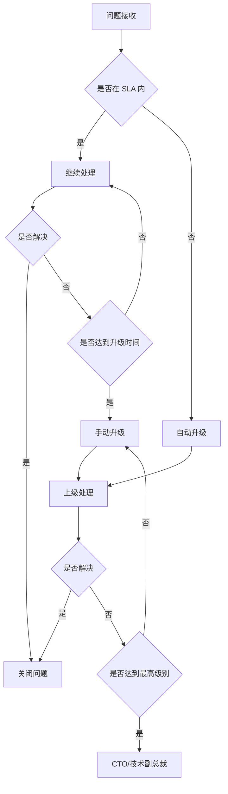
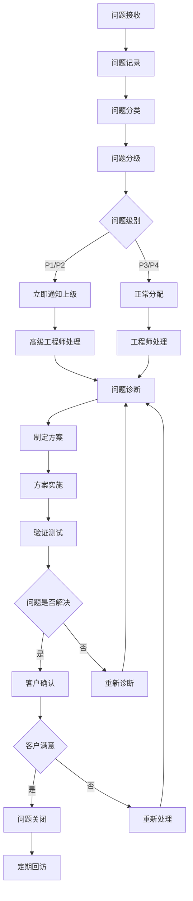
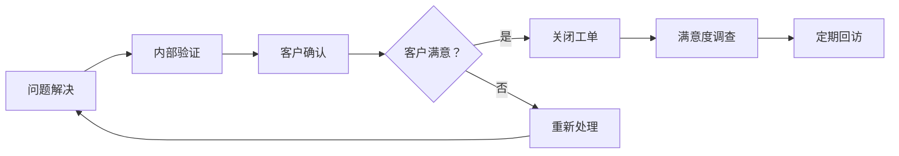
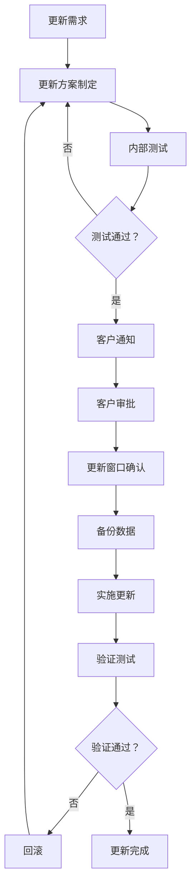
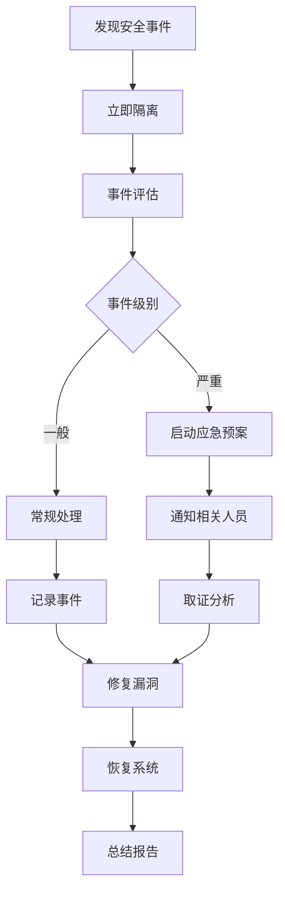
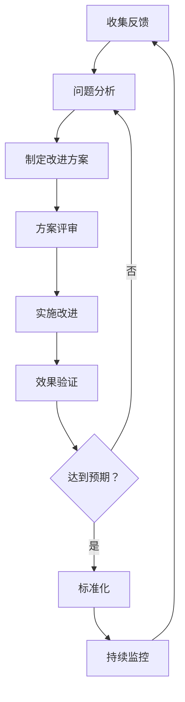

# 售后支持流程文档

## 文档信息

| 项目 | 内容 |
|------|------|
| 文档名称 | 售后支持流程规范 |
| 版本号 | V1.0 |
| 创建日期 | 2026-02-28 |
| 适用项目 | 住房租赁管理系统 |
| 保密级别 | 内部公开 |

---

## 1. 支持期限和范围

### 1.1 免费支持期限定义

根据合同约定，为客户提供不同等级的免费支持服务：

| 支持等级 | 免费期限 | 适用客户类型 | 服务内容 |
|---------|---------|-------------|---------|
| 基础版 | 3 个月 | 小型客户（房源<100 套） | 功能 bug 修复、电话支持 |
| 标准版 | 6 个月 | 中型客户（房源 100-500 套） | 功能 bug 修复、性能优化、电话 + 邮件支持 |
| 企业版 | 1 年 | 大型客户（房源>500 套） | 全范围支持、专属技术支持经理 |

**免费支持期起始时间**：自系统验收合格签字之日起计算。

### 1.2 付费支持选项

免费支持期结束后，客户可选择以下付费支持服务：

| 服务套餐 | 年费用 | 服务内容 | 响应时间 |
|---------|-------|---------|---------|
| 青铜套餐 | ¥10,000/年 | 5×8 小时支持，远程协助 | 24 小时内响应 |
| 白银套餐 | ¥25,000/年 | 5×8 小时支持，远程 + 现场（2 次/年） | 12 小时内响应 |
| 黄金套餐 | ¥50,000/年 | 7×12 小时支持，远程 + 现场（4 次/年） | 4 小时内响应 |
| 钻石套餐 | ¥100,000/年 | 7×24 小时支持，远程 + 现场（不限次） | 1 小时内响应 |

### 1.3 支持范围

**包含的支持内容**：

- ✅ **功能 Bug 修复**：系统功能异常、逻辑错误、数据错误等
- ✅ **性能问题**：系统响应缓慢、资源占用过高、并发问题等
- ✅ **使用咨询**：系统操作指导、功能使用说明、最佳实践建议
- ✅ **数据问题**：数据异常排查、数据修复、数据迁移协助
- ✅ **集成问题**：与第三方系统对接的技术支持
- ✅ **安全漏洞**：安全补丁更新、漏洞修复

### 1.4 不支持范围

**不在免费支持范围内的内容**：

- ❌ **二次开发**：客户自行或委托第三方进行的代码修改
- ❌ **定制需求**：合同范围外的新功能开发、界面定制
- ❌ **硬件问题**：服务器、网络设备、终端设备等硬件故障
- ❌ **第三方系统**：非我方提供的软件系统问题
- ❌ **人为损坏**：违规操作、恶意破坏导致的问题
- ❌ **不可抗力**：自然灾害、电力故障等不可抗力因素

**付费增值服务**（需单独报价）：

- 新功能开发
- 界面定制
- 数据迁移服务
- 现场培训
- 系统健康检查（超出合同次数）

---

## 2. 问题反馈渠道

### 2.1 支持热线

| 服务类型 | 电话号码 | 服务时间 | 说明 |
|---------|---------|---------|------|
| 技术支持热线 | 400-XXX-XXXX | 工作日 9:00-18:00 | 一般技术问题 |
| 紧急支持热线 | 138-XXXX-XXXX | 7×24 小时 | P1 级紧急问题 |
| 客服热线 | 0755-XXXX-XXXX | 工作日 9:00-18:00 | 业务咨询、投诉建议 |

### 2.2 技术支持邮箱

| 邮箱地址 | 用途 | 响应时间 |
|---------|------|---------|
| support@company.com | 一般技术支持 | 24 小时内 |
| emergency@company.com | 紧急问题 | 2 小时内 |
| feedback@company.com | 意见反馈、投诉建议 | 48 小时内 |

**邮件格式要求**：

```
邮件主题：【问题反馈】客户名称 + 问题简述 + 紧急程度

邮件内容：
- 客户名称：
- 联系人及电话：
- 问题发生时间：
- 问题现象描述：
- 影响范围：
- 已尝试的解决措施：
- 附件（截图、日志等）：
```

### 2.3 在线工单系统

**工单系统访问地址**：https://support.company.com

**工单提交流程**：


**工单状态说明**：

| 状态 | 说明 |
|------|------|
| 新建 | 工单已提交，等待分配 |
| 已分配 | 已分配给技术支持工程师 |
| 处理中 | 工程师正在处理 |
| 待确认 | 问题已解决，等待客户确认 |
| 已关闭 | 客户确认问题解决 |
| 已升级 | 问题已升级至上级处理 |

### 2.4 远程协助方式

**支持的远程协助工具**：

| 工具名称 | 使用场景 | 安全性 |
|---------|---------|--------|
| 向日葵 | 常规远程支持 | 企业级加密 |
| TeamViewer | 国际客户支持 | 端到端加密 |
| 腾讯会议 | 远程演示、培训 | 会议密码保护 |
| 企业微信 | 日常沟通、屏幕共享 | 企业内部加密 |

**远程协助流程**：

1. 客户提前预约远程支持时间
2. 技术支持发送远程会议邀请
3. 客户确认并准备环境
4. 进行远程问题排查
5. 问题解决后签字确认

### 2.5 紧急联系方式

**紧急联系人列表**：

| 姓名 | 职位 | 联系电话 | 负责区域 |
|------|------|---------|---------|
| 张 XX | 技术支持经理 | 138-XXXX-XXXX | 全国 |
| 李 XX | 技术总监 | 139-XXXX-XXXX | 华南区 |
| 王 XX | 项目经理 | 137-XXXX-XXXX | 华东区 |
| 赵 XX | 运维主管 | 136-XXXX-XXXX | 华北区 |

**紧急联系流程**：

```
客户发现 P1 级问题
    ↓
拨打紧急热线 138-XXXX-XXXX
    ↓
值班工程师接听并记录
    ↓
15 分钟内响应
    ↓
启动紧急处理流程
    ↓
每小时更新处理进度
    ↓
问题解决并确认
```

---

## 3. 服务级别协议（SLA）

### 3.1 问题分级标准

| 级别 | 名称 | 定义 | 示例 |
|------|------|------|------|
| **P1** | 紧急 | 系统完全不可用，核心业务中断，造成重大经济损失 | 系统崩溃、数据丢失、安全漏洞被利用 |
| **P2** | 高 | 系统主要功能不可用，严重影响业务运营 | 关键模块故障、性能严重下降、影响 50% 以上用户 |
| **P3** | 中 | 系统部分功能异常，对业务有一定影响但可 workaround | 非核心功能故障、界面显示错误、影响部分用户 |
| **P4** | 低 | 轻微问题，不影响业务正常使用 | 界面瑕疵、操作不便、功能建议 |

### 3.2 响应时间承诺

| 问题级别 | 首次响应时间 | 处理进度更新频率 | 服务时间 |
|---------|------------|-----------------|---------|
| P1 - 紧急 | ≤30 分钟 | 每 30 分钟 | 7×24 小时 |
| P2 - 高 | ≤2 小时 | 每 2 小时 | 7×12 小时 |
| P3 - 中 | ≤8 小时 | 每天 1 次 | 5×8 小时 |
| P4 - 低 | ≤24 小时 | 每 3 天 1 次 | 5×8 小时 |

**首次响应定义**：技术支持工程师与客户取得联系，确认问题并开始处理。

### 3.3 解决时间承诺

| 问题级别 | 目标解决时间 | 最长解决时间 | 升级时间 |
|---------|------------|------------|---------|
| P1 - 紧急 | 4 小时 | 8 小时 | 2 小时未解决 |
| P2 - 高 | 24 小时 | 48 小时 | 12 小时未解决 |
| P3 - 中 | 3 个工作日 | 5 个工作日 | 3 天未解决 |
| P4 - 低 | 7 个工作日 | 15 个工作日 | 7 天未解决 |

**解决时间定义**：从问题确认到提供解决方案或临时措施的时间。

### 3.4 SLA 详细表格

```
┌─────────────────────────────────────────────────────────────────────────────┐
│                           服务级别协议（SLA）矩阵                           │
├─────────┬───────────┬────────────┬────────────┬────────────┬───────────────┤
│ 问题级别 │ 业务影响   │ 首次响应   │ 目标解决   │ 最长解决   │ 升级机制      │
├─────────┼───────────┼────────────┼────────────┼────────────┼───────────────┤
│   P1    │ 业务中断   │ 30 分钟     │ 4 小时      │ 8 小时      │ 2 小时升级    │
│  紧急    │ 系统瘫痪   │ 7×24 小时   │ 7×24 小时   │ 7×24 小时   │ 技术总监      │
├─────────┼───────────┼────────────┼────────────┼────────────┼───────────────┤
│   P2    │ 严重影响   │ 2 小时      │ 24 小时     │ 48 小时     │ 12 小时升级   │
│  高      │ 核心功能   │ 7×12 小时   │ 7×12 小时   │ 7×12 小时   │ 支持经理      │
├─────────┼───────────┼────────────┼────────────┼────────────┼───────────────┤
│   P3    │ 中等影响   │ 8 小时      │ 3 天        │ 5 天        │ 3 天升级      │
│  中      │ 部分功能   │ 5×8 小时    │ 5×8 小时    │ 5×8 小时    │ 高级工程师    │
├─────────┼───────────┼────────────┼────────────┼────────────┼───────────────┤
│   P4    │ 轻微影响   │ 24 小时     │ 7 天        │ 15 天       │ 7 天升级      │
│  低      │ 一般问题   │ 5×8 小时    │ 5×8 小时    │ 5×8 小时    │ 技术支持      │
└─────────┴───────────┴────────────┴────────────┴────────────┴───────────────┘
```

### 3.5 升级机制

**升级触发条件**：

1. **时间升级**：超过目标解决时间仍未解决
2. **技术升级**：当前级别工程师无法解决
3. **资源升级**：需要更多资源投入
4. **客户升级**：客户主动要求升级

**升级流程**：



**升级路径**：

```
一线支持工程师
    ↓ (2 小时未解决 P1/12 小时未解决 P2)
技术支持经理
    ↓ (4 小时未解决 P1/24 小时未解决 P2)
技术总监
    ↓ (8 小时未解决 P1/48 小时未解决 P2)
CTO/技术副总裁
```

---

## 4. 问题处理流程

### 4.1 问题处理流程图



### 4.2 问题接收和记录

**接收渠道**：

- 电话热线
- 电子邮件
- 在线工单
- 微信/QQ
- 现场反馈

**记录内容**（工单模板）：

```
==================== 问题工单 ====================
工单号：SUP-2026-00001
创建时间：2026-02-28 10:30:00
客户名称：XX 住房租赁有限公司
联系人：张三
联系电话：138-XXXX-XXXX

【问题信息】
问题标题：租户模块无法批量导入数据
问题类型：☑ 功能故障 □ 性能问题 □ 使用咨询 □ 其他
问题级别：□ P1 ☑ P2 □ P3 □ P4
发生时间：2026-02-28 09:15:00
影响范围：无法批量导入租户信息，影响日常业务

【问题描述】
详细描述：
今天上午 9 点 15 分，操作员在租户管理模块使用批量导入功能时，
上传 Excel 文件后系统提示"导入失败"，但无具体错误信息。
已尝试重新上传、更换浏览器，问题依旧。

附件：
- 错误截图.png
- 导入文件样本.xlsx
- 系统日志.log

【处理记录】
2026-02-28 10:35 已分配给工程师 李四
2026-02-28 11:00 工程师开始处理
...

【解决信息】
解决时间：
解决方案：
客户确认：
满意度评价：
=================================================
```

### 4.3 问题分类和分级

**问题分类矩阵**：

| 一级分类 | 二级分类 | 三级分类 | 示例 |
|---------|---------|---------|------|
| 功能故障 | 数据管理 | 导入导出 | Excel 导入失败 |
| 功能故障 | 业务模块 | 租户管理 | 合同无法续签 |
| 功能故障 | 业务模块 | 财务管理 | 账单计算错误 |
| 性能问题 | 响应速度 | 页面加载 | 列表加载超过 10 秒 |
| 性能问题 | 并发性能 | 系统卡顿 | 多人同时操作时系统缓慢 |
| 使用咨询 | 操作指导 | 功能使用 | 如何设置租金提醒 |
| 使用咨询 | 配置问题 | 参数设置 | 如何修改审批流程 |
| 安全问题 | 漏洞报告 | 权限漏洞 | 未授权访问 |
| 安全问题 | 数据异常 | 数据错误 | 数据不一致 |

**分级判定检查表**：

```
P1 级判定（满足任一条件）：
□ 系统完全无法访问
□ 核心业务数据丢失或损坏
□ 安全漏洞正在被利用
□ 影响所有用户正常使用
□ 造成重大经济损失（>10 万元/小时）

P2 级判定（满足任一条件）：
□ 核心功能模块无法使用
□ 影响 50% 以上用户
□ 性能严重下降（响应时间>30 秒）
□ 造成较大经济损失（1-10 万元/小时）

P3 级判定（满足任一条件）：
□ 非核心功能异常
□ 影响部分用户（<50%）
□ 有临时替代方案
□ 造成一定经济损失（<1 万元/小时）

P4 级判定：
□ 界面显示问题
□ 操作不便
□ 功能优化建议
□ 不影响业务正常使用
```

### 4.4 问题分配和处理

**分配规则**：

| 问题类型 | 分配对象 | 备份人员 |
|---------|---------|---------|
| 功能故障 | 开发工程师 | 高级开发工程师 |
| 性能问题 | 性能优化工程师 | 架构师 |
| 数据问题 | 数据库工程师 | DBA 主管 |
| 安全问题 | 安全工程师 | 安全总监 |
| 使用咨询 | 技术支持工程师 | 技术支持经理 |

**处理流程**：

1. **接收工单**：工程师确认接收分配的问题
2. **初步分析**：分析问题原因，判断是否需要协助
3. **复现问题**：在测试环境尝试复现问题
4. **定位原因**：通过日志、监控等工具定位问题根源
5. **制定方案**：制定解决方案并评估风险
6. **实施方案**：在合适时间窗口实施修复
7. **验证结果**：验证问题是否解决，确保无副作用

### 4.5 问题跟踪和反馈

**跟踪要求**：

| 问题级别 | 更新频率 | 更新内容 | 通知方式 |
|---------|---------|---------|---------|
| P1 | 每 30 分钟 | 处理进展、下一步计划 | 电话 + 邮件 |
| P2 | 每 2 小时 | 处理进展、预计完成时间 | 邮件 + 微信 |
| P3 | 每天 1 次 | 处理进展、阻塞问题 | 邮件 |
| P4 | 每 3 天 1 次 | 处理状态 | 工单系统 |

**进度更新模板**：

```
【问题进度更新】
工单号：SUP-2026-00001
更新时间：2026-02-28 14:00
当前状态：处理中

【本次更新内容】
已完成：
1. 定位到问题原因为 Excel 模板格式变更导致解析失败
2. 修复代码已完成并通过单元测试

进行中：
1. 正在部署到测试环境进行集成测试

下一步计划：
1. 15:00 前完成测试环境验证
2. 16:00 前部署到生产环境
3. 17:00 前完成客户验证

预计解决时间：2026-02-28 17:00

【需要客户配合事项】
无

技术支持工程师：李四
联系电话：138-XXXX-XXXX
```

### 4.6 问题关闭和回访

**关闭条件**：

- ✅ 问题已解决并验证
- ✅ 客户确认接受解决方案
- ✅ 所有文档已更新
- ✅ 知识库已补充（如适用）

**关闭流程**：



**客户回访模板**：

```
==================== 客户回访记录 ====================
回访日期：2026-03-07
回访方式：☑ 电话 □ 邮件 □ 现场
客户名称：XX 住房租赁有限公司
联系人：张三
工单号：SUP-2026-00001

【问题回顾】
问题描述：租户模块无法批量导入数据
解决时间：2026-02-28 16:30
解决方式：修复 Excel 解析模块兼容性问题

【客户反馈】
问题是否彻底解决：☑ 是 □ 否
对解决速度是否满意：☑ 非常满意 □ 满意 □ 一般 □ 不满意
对服务态度是否满意：☑ 非常满意 □ 满意 □ 一般 □ 不满意
对技术方案是否满意：☑ 非常满意 □ 满意 □ 一般 □ 不满意

【意见和建议】
客户意见：
改进建议：

【后续需求】
是否有其他需求：□ 是 ☑ 否
需求描述：

回访人：王五
=================================================
```

---

## 5. 维护计划

### 5.1 定期巡检计划

**月度检查**（每月第一个工作日）：

| 检查项 | 检查内容 | 检查方法 | 标准 |
|-------|---------|---------|------|
| 系统可用性 | 系统正常运行时间 | 监控系统 | ≥99.5% |
| 性能指标 | 平均响应时间 | APM 工具 | <3 秒 |
| 错误日志 | 错误数量和类型 | 日志分析 | 严重错误=0 |
| 数据库 | 连接数、慢查询 | 数据库监控 | 慢查询<10 条/天 |
| 服务器资源 | CPU、内存、磁盘使用率 | 监控工具 | 使用率<80% |

**季度检查**（每季度第一个月）：

| 检查项 | 检查内容 | 检查方法 | 交付物 |
|-------|---------|---------|--------|
| 系统健康检查 | 全面系统健康评估 | 自动化检测 + 人工检查 | 《系统健康报告》 |
| 安全扫描 | 漏洞扫描、渗透测试 | 安全工具 + 人工测试 | 《安全评估报告》 |
| 性能测试 | 压力测试、负载测试 | 性能测试工具 | 《性能测试报告》 |
| 备份验证 | 备份数据完整性验证 | 恢复测试 | 《备份验证报告》 |
| 代码审查 | 代码质量检查 | 代码扫描工具 | 《代码质量报告》 |

**年度检查**：

- 系统架构评估
- 技术债务评估
- 容量规划
- 灾备演练
- 合规性审查

### 5.2 系统更新策略

**补丁更新**：

| 补丁类型 | 更新频率 | 更新时间 | 审批流程 |
|---------|---------|---------|---------|
| 安全补丁 | 紧急 | 发现后 48 小时内 | 安全总监审批 |
| Bug 修复 | 每周 | 周四 22:00-24:00 | 技术经理审批 |
| 小功能优化 | 每两周 | 双周周四 22:00-24:00 | 产品经理审批 |

**版本升级**：

| 升级类型 | 周期 | 更新内容 | 停机时间 |
|---------|------|---------|---------|
| 小版本（V1.1→V1.2） | 每月 | 功能优化、Bug 修复 | <2 小时 |
| 中版本（V1.0→V2.0） | 每季度 | 新功能模块 | <4 小时 |
| 大版本（V1.0→V2.0） | 每年 | 架构升级、重大功能 | <8 小时 |

**更新流程**：



### 5.3 数据备份检查

**备份策略**：

| 数据类型 | 备份频率 | 保留周期 | 备份方式 |
|---------|---------|---------|---------|
| 业务数据 | 实时增量 + 每日全量 | 30 天 | 本地 + 异地 |
| 日志数据 | 每日增量 | 90 天 | 本地 |
| 配置数据 | 每次变更后 | 永久 | 本地 + 异地 |
| 附件数据 | 每日增量 | 180 天 | 对象存储 |

**备份检查清单**：

```
□ 备份任务执行状态检查（每日）
□ 备份文件大小验证（每日）
□ 备份日志检查（每日）
□ 备份数据完整性验证（每周）
□ 备份恢复测试（每月）
□ 异地备份同步检查（每周）
□ 备份存储空间检查（每周）
□ 备份加密验证（每月）
```

### 5.4 性能优化建议

**性能监控指标**：

| 指标 | 正常范围 | 警告阈值 | 严重阈值 |
|------|---------|---------|---------|
| 页面响应时间 | <2 秒 | 2-5 秒 | >5 秒 |
| API 响应时间 | <500ms | 500-1000ms | >1000ms |
| 数据库查询时间 | <100ms | 100-500ms | >500ms |
| CPU 使用率 | <60% | 60-80% | >80% |
| 内存使用率 | <70% | 70-85% | >85% |
| 磁盘 I/O | <70% | 70-85% | >85% |

**优化建议**：

1. **数据库优化**
   - 定期分析慢查询日志
   - 优化索引策略
   - 定期清理历史数据
   - 实施读写分离

2. **应用优化**
   - 实施缓存策略（Redis）
   - 异步处理耗时操作
   - 实施负载均衡
   - 代码性能优化

3. **前端优化**
   - 静态资源 CDN 加速
   - 实施懒加载
   - 减少 HTTP 请求
   - 压缩资源文件

### 5.5 安全加固措施

**安全加固清单**：

| 加固项 | 实施频率 | 责任人 | 验收标准 |
|-------|---------|--------|---------|
| 系统补丁更新 | 每月 | 运维工程师 | 无高危漏洞 |
| 密码策略检查 | 每季度 | 安全工程师 | 符合复杂度要求 |
| 权限审查 | 每季度 | 安全主管 | 最小权限原则 |
| 安全日志审计 | 每周 | 安全工程师 | 无异常访问 |
| 防火墙规则审查 | 每月 | 网络工程师 | 规则最小化 |
| 数据加密检查 | 每半年 | 安全总监 | 敏感数据全加密 |
| 渗透测试 | 每年 | 第三方机构 | 无高危漏洞 |

**应急响应流程**：



---

## 6. 客户培训和支持

### 6.1 持续培训计划

**培训课程体系**：

| 课程名称 | 目标学员 | 课程时长 | 培训方式 | 频率 |
|---------|---------|---------|---------|------|
| 系统基础操作 | 新用户 | 4 小时 | 线上直播 | 每月 2 次 |
| 高级功能应用 | 资深用户 | 8 小时 | 线上 + 线下 | 每月 1 次 |
| 管理员培训 | 系统管理员 | 16 小时 | 线下集中 | 每季度 1 次 |
| 最佳实践分享 | 全体用户 | 2 小时 | 线上直播 | 每月 1 次 |
| 新功能培训 | 全体用户 | 2 小时 | 线上直播 | 按需 |

**培训资料**：

- 《用户操作手册》
- 《系统管理员指南》
- 《常见问题 FAQ》
- 《最佳实践案例集》
- 培训视频录像

### 6.2 知识库建设

**知识库结构**：

```
知识库
├── 产品文档
│   ├── 产品介绍
│   ├── 功能说明
│   └── 更新日志
├── 操作指南
│   ├── 快速入门
│   ├── 详细教程
│   └── 视频教程
├── 常见问题
│   ├── 安装部署
│   ├── 功能使用
│   └── 故障排查
├── 技术文档
│   ├── API 文档
│   ├── 数据库设计
│   └── 接口文档
└── 最佳实践
    ├── 行业案例
    ├── 配置优化
    └── 性能调优
```

**知识库更新机制**：

- 每个问题解决后 3 个工作日内更新相关知识库文章
- 每月审核知识库内容，确保准确性
- 每季度补充新的最佳实践案例

### 6.3 用户社区支持

**社区平台**：

| 平台 | 地址 | 用途 | 运营时间 |
|------|------|------|---------|
| 官方论坛 | bbs.company.com | 用户交流、问题讨论 | 7×24 小时 |
| 微信公众号 | XX 科技 | 产品动态、使用技巧 | 工作日 |
| QQ 用户群 | XXXXXXXX | 即时交流、互助答疑 | 7×12 小时 |
| 知识星球 | XXXXX | 深度内容、专家答疑 | 工作日 |

**社区运营**：

- 每日回复用户提问
- 每周发布使用技巧
- 每月举办线上活动
- 每季度评选优秀用户

### 6.4 最佳实践分享

**分享形式**：

1. **月度线上分享会**
   - 时间：每月最后一个周五 15:00-16:00
   - 内容：优秀客户案例、使用技巧、新功能演示
   - 形式：线上直播 + 互动问答

2. **季度线下沙龙**
   - 时间：每季度一次
   - 地点：一线城市轮流举办
   - 内容：深度交流、经验分享、产品规划沟通

3. **年度用户大会**
   - 时间：每年 11 月
   - 规模：500+ 用户
   - 内容：产品发布、 awards 颁奖、深度培训

**最佳实践文档模板**：

```
==================== 最佳实践案例 ====================
案例名称：XX 公司租户管理优化实践
所属行业：长租公寓
房源规模：5000+ 套
实施时间：2025-10

【背景介绍】
公司简介：
面临的问题：

【解决方案】
实施方案：
关键配置：

【实施效果】
效率提升：
成本节约：
用户满意度：

【经验总结】
成功经验：
注意事项：

【联系方式】
客户联系人：
分享日期：2026-02-28
=================================================
```

---

## 7. 支持质量评估

### 7.1 客户满意度调查

**调查方式**：

| 调查类型 | 触发时机 | 调查方式 | 样本量 |
|---------|---------|---------|--------|
| 工单满意度 | 每个工单关闭后 | 邮件/短信链接 | 100% |
| 月度满意度 | 每月末 | 在线问卷 | 活跃客户 30% |
| 季度满意度 | 每季度末 | 电话访谈 | 重点客户 100% |
| 年度满意度 | 每年末 | 深度调研 | 全部客户 |

**满意度评价指标**：

```
==================== 满意度评价表 ====================
评价维度          权重    评分 (1-5 分)
─────────────────────────────────────────
响应速度          20%     □1 □2 □3 □4 □5
解决效率          25%     □1 □2 □3 □4 □5
技术水平          20%     □1 □2 □3 □4 □5
服务态度          15%     □1 □2 □3 □4 □5
沟通效果          10%     □1 □2 □3 □4 □5
整体满意度        10%     □1 □2 □3 □4 □5
─────────────────────────────────────────
总体得分：___ / 5 分

开放性问题：
1. 您最满意的地方：
2. 需要改进的地方：
3. 其他建议：
=================================================
```

**满意度计算**：

```
满意度得分 = (5 分×100% + 4 分×80% + 3 分×60% + 2 分×40% + 1 分×20%) / 总样本数

满意度等级：
- 非常满意：4.5-5.0 分
- 满意：4.0-4.4 分
- 一般：3.5-3.9 分
- 不满意：<3.5 分
```

### 7.2 支持效果评估

**关键绩效指标（KPI）**：

| 指标 | 定义 | 目标值 | 计算方式 |
|------|------|--------|---------|
| 首次响应达标率 | SLA 内响应工单比例 | ≥95% | SLA 内响应数/总工单数 |
| 问题解决率 | 一次性解决工单比例 | ≥85% | 一次解决数/总工单数 |
| 平均解决时间 | 工单平均处理时长 | <8 小时 | 总处理时长/工单总数 |
| 客户满意度 | 客户评分平均值 | ≥4.5 分 | 总评分/评价数 |
| 工单重开率 | 重新打开工单比例 | ≤5% | 重开工单数/关闭工单数 |
| 升级率 | 需要升级工单比例 | ≤10% | 升级工单数/总工单数 |

**月度支持报告模板**：

```
==================== 月度支持服务报告 ====================
报告期间：2026 年 02 月
客户名称：XX 住房租赁有限公司

【工单统计】
工单总数：45 个
  - P1 紧急：2 个
  - P2 高：8 个
  - P3 中：25 个
  - P4 低：10 个

工单状态：
  - 已关闭：43 个
  - 处理中：2 个

【SLA 达成情况】
首次响应达标率：97.8% (目标：95%) ✓
解决时间达标率：93.3% (目标：90%) ✓
客户满意度：4.7/5.0 (目标：4.5) ✓

【主要问题 TOP5】
1. 租户导入问题 (8 次)
2. 账单计算问题 (6 次)
3. 权限配置问题 (5 次)
4. 报表导出问题 (4 次)
5. 系统登录问题 (3 次)

【改进措施】
1. 针对导入问题，已优化导入模块
2. 计划开展账单模块专题培训
3. 更新权限配置操作手册

【下月计划】
1. 系统季度健康检查
2. 管理员进阶培训
3. 新功能上线支持
=================================================
```

### 7.3 持续改进机制

**改进流程**：



**改进来源**：

1. **客户反馈**
   - 满意度调查
   - 工单评价
   - 投诉建议
   - 定期回访

2. **内部分析**
   - 工单数据分析
   - 问题趋势分析
   - 根本原因分析

3. **行业对标**
   - 竞争对手分析
   - 行业最佳实践
   - 新技术应用

**改进措施分类**：

| 改进类型 | 实施周期 | 审批级别 | 示例 |
|---------|---------|---------|------|
| 快速改进 | 1 周内 | 部门经理 | 文档更新、话术优化 |
| 中期改进 | 1-3 个月 | 技术总监 | 功能优化、流程改进 |
| 长期改进 | 3-6 个月 | 公司管理层 | 架构升级、系统重构 |

**改进跟踪表**：

```
┌─────────────────────────────────────────────────────────────────────────────┐
│                           持续改进跟踪表                                     │
├──────┬──────────────┬────────────┬────────────┬────────────┬───────────────┤
│ 编号 │ 改进项目     │ 来源       │ 优先级     │ 状态       │ 预计完成     │
├──────┼──────────────┼────────────┼────────────┼────────────┼───────────────┤
│ 001  │ 优化工单分配 │ 客户反馈   │ 高         │ 进行中     │ 2026-03-15   │
│ 002  │ 更新操作手册 │ 内部分析   │ 中         │ 已完成     │ 2026-02-20   │
│ 003  │ 增加知识库   │ 满意度调查 │ 中         │ 待启动     │ 2026-03-30   │
│ 004  │ 系统性能优化 │ 监控数据   │ 高         │ 进行中     │ 2026-03-25   │
│ 005  │ 培训视频制作 │ 客户需求   │ 低         │ 待启动     │ 2026-04-15   │
└──────┴──────────────┴────────────┴────────────┴────────────┴───────────────┘
```

---

## 附录

### 附录 A：术语表

| 术语 | 定义 |
|------|------|
| SLA | 服务级别协议（Service Level Agreement） |
| P1/P2/P3/P4 | 问题优先级分类 |
| 首次响应 | 技术支持与客户首次取得联系的时间点 |
| 解决时间 | 从问题确认到提供解决方案的时间 |
| 工单 | 问题跟踪的基本单位 |
| 升级 | 将问题转交更高级别技术人员处理 |

### 附录 B：相关文档

- [《系统部署指南》](../deployment-guide.md)
- [《用户操作手册》](../user-manual.md)
- [《验收流程规范》](acceptance-process.md)
- [《培训计划》](training-plan.md)

### 附录 C：文档修订记录

| 版本 | 日期 | 修订人 | 修订内容 |
|------|------|--------|---------|
| V1.0 | 2026-02-28 | 技术部 | 初始版本 |

---

**文档结束**
